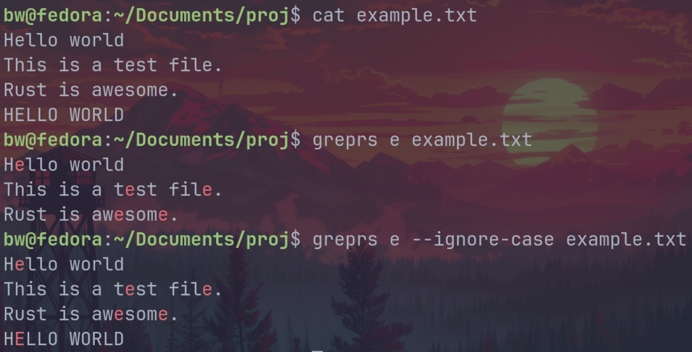

# greprs

**greprs** is a lightweight, barebones grep clone written in Rust. It supports recursive directory searching and regex pattern matching with optional case-insensitivity.

---

## Features

- Recursive search through directories by default  
- Regex pattern matching  
- Case-insensitive search option  
- Parallel file processing for faster search  
- Simple CLI with help messages  

---

## Usage

```bash
greprs [OPTIONS] <pattern> <file_or_directory>...
```

## Examples

**Search for the pattern "error" recursively in the logs directory:**
```bash
greprs error ./logs
```
**Show help message:**
```
greprs --help
```

**Usage of a single file**


---

# Installation

### Clone the repository

```
git clone https://github.com/brweinstein/greprs.git
cd greprs
```

### Install using Cargo

```
cargo install --path .
```

---

# Development

**To build and run locally:**

```
cargo run -- [pattern] [file/dir]...
```

**To run tests:**
```
cargo test
```

---

# License

MIT License
(c) 2025 Ben Weinstein

Let me know if you want me to customize it further!