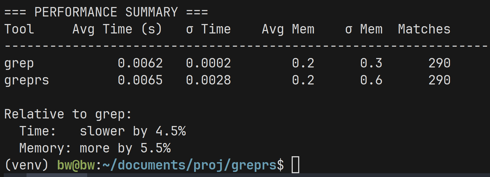

# greprs

A fast grep clone written in Rust with parallel processing and modern features.

## Features

- **Pattern matching**: Basic regex, fixed strings, word/line boundaries
- **Search options**: Case-insensitive, recursive directories, inverted matching  
- **Output controls**: Line numbers, match counts, filename display
- **Performance**: Memory-mapped files, parallel processing, optimized output

## Performance Optimizations

- **Memory mapping** for large files (>1MB) to avoid loading into RAM
- **Buffered output** to reduce syscall overhead
- **Early exit optimizations** for simple cases (quiet, count, file listing)
- **Parallel directory traversal** for large directory trees
- **Pre-allocated buffers** and reduced string allocations
- **Fast binary file detection** using file extensions

## Quick Start

```bash
# Search for "error" in logs directory
greprs "error" ./logs

# Case-insensitive search with line numbers
greprs -in "TODO" ./src

# Count matches in all Rust files
greprs -c "panic!" ./src

# Find files containing "deprecated"  
greprs -l "deprecated" ./
```

## Installation

```bash
git clone https://github.com/brweinstein/greprs.git
cd greprs
cargo build --release
cargo install --path .
```

After installing, make sure `~/.cargo/bin` is in your `PATH`:
```bash
export PATH="$HOME/.cargo/bin:$PATH"
```

## Usage

```bash
greprs [OPTIONS] <pattern> <files...>
```

## All Options

| Short | Long                    | Description                                      |
|-------|------------------------|--------------------------------------------------|
| `-i`  | `--ignore-case`        | Ignore case distinctions                         |
| `-r`  | `--recursive`          | Recursively search directories                   |
| `-R`  | `--dereference-recursive` | Follow symbolic links                         |
| `-n`  | `--line-number`        | Show line numbers for matches                    |
| `-c`  | `--count`              | Print only a count of matching lines per file   |
| `-l`  | `--files-with-matches` | List only files containing matches               |
| `-L`  | `--files-without-match`| List only files without matches                 |
| `-v`  | `--invert-match`       | Show non-matching lines                          |
| `-F`  | `--fixed-strings`      | Treat pattern as a literal string                |
| `-w`  | `--word-regexp`        | Match only whole words                           |
| `-x`  | `--line-regexp`        | Match only whole lines                           |
| `-o`  | `--only-matching`      | Print only the matched parts of lines           |
| `-q`  | `--quiet`              | Suppress normal output; exit with 0 if match    |
| `-s`  | `--no-messages`        | Suppress error messages                          |
| `-h`  | `--no-filename`        | Suppress the prefixing of file names             |
| `-H`  | `--with-filename`      | Always print file name for matches              |
| `-A`  | `--after-context=NUM`  | Show NUM lines after each match                  |
| `-B`  | `--before-context=NUM` | Show NUM lines before each match                 |
| `-C`  | `--context=NUM`        | Show NUM lines before and after each match      |
| `-m`  | `--max-count=NUM`      | Stop after NUM matches                           |
| `-b`  | `--byte-offset`        | Print byte offset of each match                  |
| `-a`  | `--text`               | Process binary files as text                     |
| `-I`  | `--ignore-binary`      | Skip binary files                                |
| `-z`  | `--null`               | Use null character as line separator             |
|       | `--null-data`          | Use null character as record separator          |
| `-f`  | `--file=FILE`          | Read patterns from FILE                          |
|       | `--exclude=GLOB`       | Skip files matching GLOB pattern                |
|       | `--include=GLOB`       | Search only files matching GLOB pattern         |
|       | `--color[=WHEN]`       | Use colored output (auto/always/never)          |
|       | `--help`               | Show help message                                |
| `-V`  | `--version`            | Show version information                         |

**Examples:**
```bash
greprs -ir "error" ./logs
greprs -c "TODO" ./src
greprs -l "panic!" ./src
greprs -v "deprecated" ./
greprs -w "main" ./src
greprs -x "fn main()" ./src
```

For more details, run:
```bash
greprs --help
```

## Performance

Now optimized to be competitive with GNU grep on most workloads.

### From Small Benchmark


Run your own benchmarks (small, medium, large):
```bash
./benchmark/compare.py --greprs-bin target/release/greprs --workload medium
```

## Development

```bash
# Build optimized version
cargo build --release

# Run tests
cargo test

# Run locally  
cargo run --release -- "pattern" ./files
```

---

MIT License © 2025 Ben Weinstein